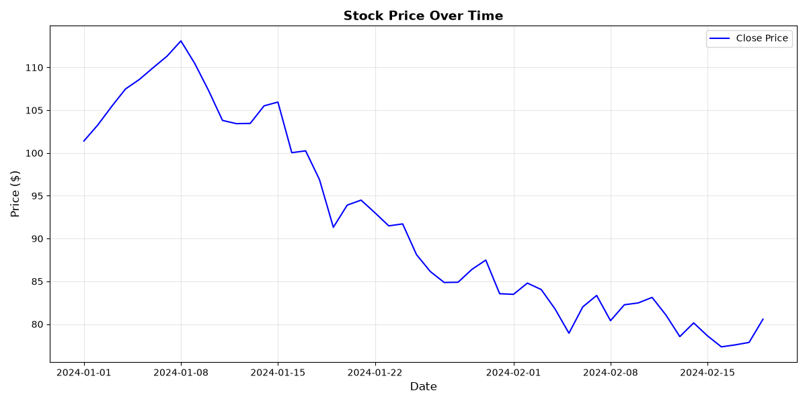
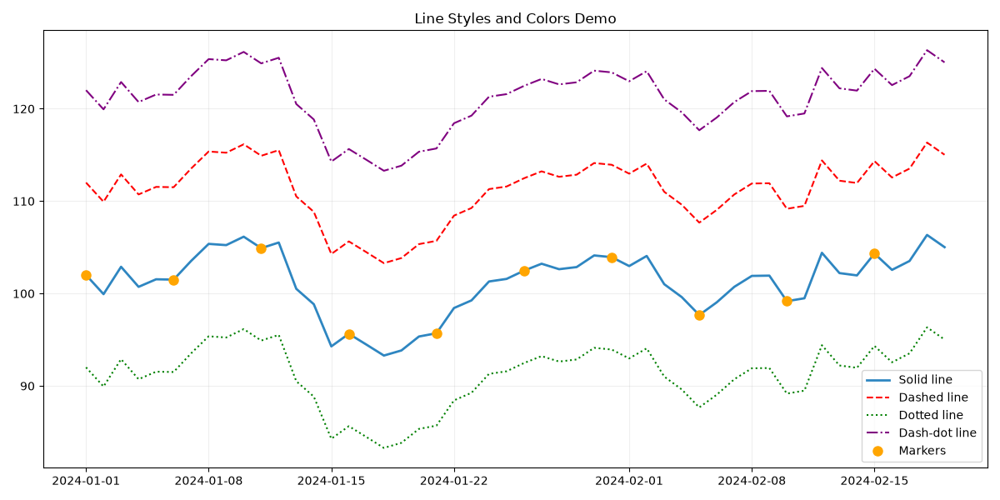
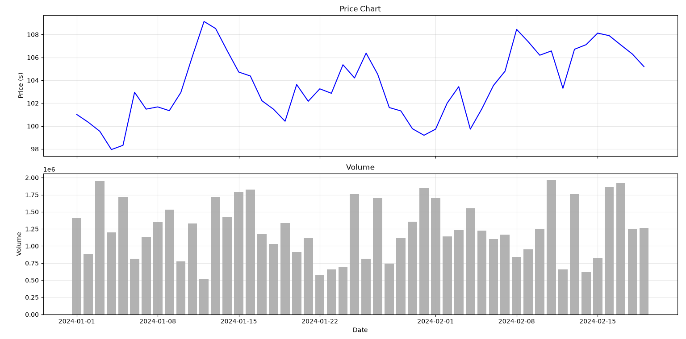
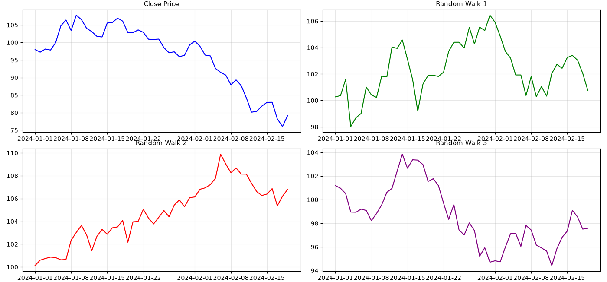
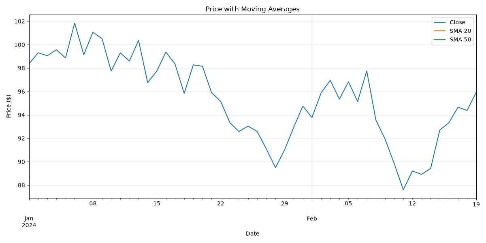
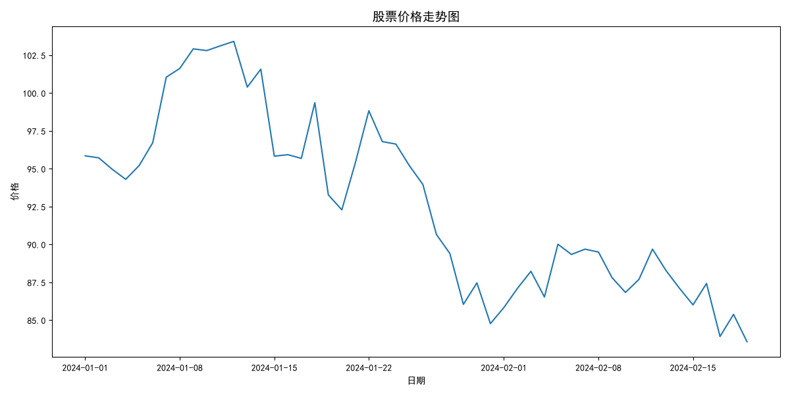

### 3.1 Matplotlib基础用法

在完成数据准备之后，我们面临一个更直观的问题：如何将枯燥的数字转化为能够让人一眼读懂的可视化图形？技术分析的本质是发现数据中的规律，而人类的大脑天生擅长处理视觉信息——一张精心绘制的图表所传达的信息，往往胜过千行数字。Matplotlib正是Python生态中最核心、最成熟的可视化工具，所有其他Python绘图库几乎都建立在它的基础之上。掌握了Matplotlib，你就掌握了对图表每个细节的绝对控制权。

#### Matplotlib的核心设计哲学

要理解Matplotlib的工作方式，首先需要理解它的架构。Matplotlib的设计借鉴了MATLAB的绘图风格，其核心遵循一个明确的层次结构：

**Figure（画布）** 是整个绘图的最外层容器。你可以把它想象成一块空白的画板——在它上面可以放置一个或多个Axes。一个Figure对应一个图形窗口或一张图片文件。

**Axes（坐标轴区域）** 是实际的绘图区域。每个Axes包含一个X轴、一个Y轴、一个标题以及数据绘制的区域。一个Figure中可以包含多个Axes，分别呈现不同的子图。

**Axis（坐标轴）** 是Axes的组成部分，负责管理刻度线、刻度标签和坐标轴标签。一个Axes通常有两个Axis（X轴和Y轴），在三维图中还有第三个。

**Artist（图形元素）** 是所有可见元素的基类——线条、点、柱状条、文本、图例等，都属于Artist。每个Artist都可以独立控制其样式、颜色、透明度等属性。

理解这一层次结构对于调试和定制图表至关重要。当你看到一段绘图代码时，能够分辨出它在操作Figure、Axes还是具体的Artist，就能更准确地调整它。

#### 基本绘图流程

Matplotlib的绘图流程可以概括为三个步骤：准备数据、创建图形与坐标轴、绘制与修饰。下面是一个最基础的折线图示例：

```python
import matplotlib.pyplot as plt
import numpy as np
import pandas as pd

# Step 1: Prepare data
dates = pd.date_range('2024-01-01', periods=50, freq='D')
prices = 100 + np.cumsum(np.random.randn(50) * 2)  # Simulated random walk

# Step 2: Create figure and axes
fig, ax = plt.subplots(figsize=(12, 6))

# Step 3: Plot and customize
ax.plot(dates, prices, color='blue', linewidth=1.5, label='Close Price')
ax.set_title('Stock Price Over Time', fontsize=14, fontweight='bold')
ax.set_xlabel('Date', fontsize=12)
ax.set_ylabel('Price ($)', fontsize=12)
ax.legend(loc='best')
ax.grid(True, alpha=0.3)

# Step 4: Display
plt.tight_layout()
plt.show()
```

这里有几个关键点需要留意。`fig, ax = plt.subplots()`这一行返回两个对象，而不是一个。`fig`是画布，`ax`是坐标轴区域。通过`ax`的系列方法（如`plot`、`set_title`、`set_xlabel`）来绘制和装饰图表，是Matplotlib的“面向对象”风格。虽然Matplotlib也提供类似于`plt.plot()`的简化接口（称为`pyplot`状态机风格），但面向对象的方式在绘制多子图时更加清晰和可控。



#### 图形样式控制：颜色、线型与标记

Matplotlib提供了极其丰富的样式控制选项。仅仅一条`plot`命令，就可以通过参数组合出多种视觉效果：

```python
# Demonstrate various line styles and markers
fig, ax = plt.subplots(figsize=(12, 6))

# Different colors and line styles
ax.plot(dates, prices, color='#2E86C1', linewidth=2, linestyle='-', label='Solid line')
ax.plot(dates, prices + 10, color='red', linewidth=1.5, linestyle='--', label='Dashed line')
ax.plot(dates, prices - 10, color='green', linewidth=1.5, linestyle=':', label='Dotted line')
ax.plot(dates, prices + 20, color='purple', linewidth=1.5, linestyle='-.', label='Dash-dot line')

# Adding markers
ax.plot(dates[::5], prices[::5], 'o', color='orange', markersize=8, label='Markers')

ax.set_title('Line Styles and Colors Demo')
ax.legend()
ax.grid(True, alpha=0.2)
plt.tight_layout()
plt.show()
```

颜色的指定方式非常灵活——你可以使用预定义的颜色名称（如`'red'`、`'blue'`），也可以使用十六进制颜色代码（如`'#2E86C1'`），还可以使用RGB元组（如`(0.2, 0.4, 0.6)`）。线型方面，`'-'`表示实线，`'--'`表示虚线，`':'`表示点线，`'-.'`表示点划线。标记符号则包括`'o'`（圆圈）、`'s'`（方块）、`'^'`（三角形）、`'*'`（星号）等多种选择。

在实际的金融图表中，通常不会使用过于花哨的样式，但掌握这些选项有助于你根据需要突出特定的数据特征。



#### 多子图布局

当我们需要同时展示价格和某个技术指标时，多子图布局就显得尤为重要。Matplotlib的`subplots`函数可以轻松创建网格状的子图结构：

```python
# Create a 2x1 grid of subplots
fig, axes = plt.subplots(nrows=2, ncols=1, figsize=(12, 8), sharex=True)

# Top subplot: price chart
axes[0].plot(dates, prices, color='blue', linewidth=1.5)
axes[0].set_title('Price Chart', fontsize=12)
axes[0].set_ylabel('Price ($)')
axes[0].grid(True, alpha=0.3)

# Bottom subplot: volume chart
volumes = np.random.randint(500000, 2000000, size=len(dates))
axes[1].bar(dates, volumes, color='gray', alpha=0.6, width=0.8)
axes[1].set_title('Volume', fontsize=12)
axes[1].set_xlabel('Date')
axes[1].set_ylabel('Volume')
axes[1].grid(True, alpha=0.3)

plt.tight_layout()
plt.show()
```

这里的`sharex=True`参数非常重要——它让两个子图共享X轴，这意味着当你缩放或平移底部子图时，顶部子图会自动跟随。这在金融分析中几乎是标配，因为价格和成交量共享同一时间轴，我们需要确保它们完全对齐。



当子图数量较多时，可以结合循环来简化代码：

```python
# Create a 2x2 grid of subplots
fig, axes = plt.subplots(nrows=2, ncols=2, figsize=(14, 10))

# Flatten the 2D axes array for easier iteration
axes_flat = axes.flatten()

# List of (data, title, color) tuples
plots_data = [
    (prices, 'Close Price', 'blue'),
    (np.random.randn(50).cumsum() + 100, 'Random Walk 1', 'green'),
    (np.random.randn(50).cumsum() + 100, 'Random Walk 2', 'red'),
    (np.random.randn(50).cumsum() + 100, 'Random Walk 3', 'purple'),
]

for idx, (data, title, color) in enumerate(plots_data):
    axes_flat[idx].plot(dates, data, color=color, linewidth=1.5)
    axes_flat[idx].set_title(title, fontsize=11)
    axes_flat[idx].grid(True, alpha=0.3)

plt.tight_layout()
plt.show()
```



#### 与Pandas DataFrame的集成

在实际工作中，我们很少直接操作NumPy数组来绘图——更常见的情况是，数据已经以DataFrame的形式存在。Pandas的`plot`方法是对Matplotlib的轻量级封装，它简化了从DataFrame直接绘制图表的流程：

```python
# Create a sample DataFrame
df = pd.DataFrame({
    'close': prices,
    'sma_20': pd.Series(prices).rolling(20).mean(),
    'sma_50': pd.Series(prices).rolling(50).mean(),
}, index=dates)

# Use Pandas built-in plotting
fig, ax = plt.subplots(figsize=(12, 6))
df[['close', 'sma_20', 'sma_50']].plot(ax=ax, linewidth=1.5)
ax.set_title('Price with Moving Averages')
ax.set_xlabel('Date')
ax.set_ylabel('Price ($)')
ax.legend(['Close', 'SMA 20', 'SMA 50'])
ax.grid(True, alpha=0.3)
plt.tight_layout()
plt.show()
```

`df.plot()`默认会使用DataFrame的索引作为X轴，并绘制所有指定的列为Y轴。`ax`参数允许我们将绘制结果放到指定的坐标轴区域上，这在多子图场景中非常有用。

需要注意的是，Pandas的`plot`方法在便利性上做了大量妥协——它的定制能力远不如直接使用Matplotlib的面向对象API。当图表需要精细调整时（比如设置次坐标轴、自定义图例位置、添加注释等），我们仍然需要回到Matplotlib的原生接口。



#### 图表美化：中文显示、颜色主题与注释

**中文显示**是全球读者都需要面对的一个实际问题。Matplotlib默认的字体不支持中文字符，如果直接绘制包含中文的标题或标签，你会看到一堆小方块。解决方案是在绘图前设置支持中文的字体：

```python
# Configure font for Chinese characters
plt.rcParams['font.sans-serif'] = ['SimHei', 'Arial Unicode MS', 'DejaVu Sans']
plt.rcParams['axes.unicode_minus'] = False  # Fix minus sign display issue

# Now Chinese text will render correctly
fig, ax = plt.subplots(figsize=(12, 6))
ax.plot(dates, prices, linewidth=1.5)
ax.set_title('股票价格走势图', fontsize=14)  # Chinese title
ax.set_xlabel('日期')
ax.set_ylabel('价格')
plt.tight_layout()
plt.show()
```

不同操作系统上可用的中文字体不同——Windows通常有`SimHei`或`Microsoft YaHei`，macOS有`PingFang SC`或`STHeiti`，Linux则需要安装`文泉驿`等中文字体包。为了提高跨平台兼容性，可以使用`Arial Unicode MS`这个广泛可用的字体。



**颜色主题**方面，金融图表有其约定俗成的配色习惯。一个通用的做法是使用预定义的配色循环：

```python
# Use a professional color palette
colors = plt.cm.tab10.colors  # A 10-color qualitative palette

fig, ax = plt.subplots(figsize=(12, 6))
for i, col in enumerate(['close', 'sma_20', 'sma_50']):
    ax.plot(df.index, df[col], color=colors[i % len(colors)], 
            linewidth=1.5, label=col.title())

ax.legend()
ax.grid(True, alpha=0.2)
plt.tight_layout()
plt.show()
```

**注释**是图表中传达关键信息的有效方式——比如在某个特殊日期标注一个箭头，或者在图表的某个位置添加说明文字：

```python
fig, ax = plt.subplots(figsize=(12, 6))
ax.plot(dates, prices, color='blue', linewidth=1.5)

# Add an annotation at a specific point
special_date = dates[15]
special_price = prices[15]
ax.plot(special_date, special_price, 'ro', markersize=10)

ax.annotate(
    'Important turning point',
    xy=(special_date, special_price),
    xytext=(special_date + pd.Timedelta(days=5), special_price + 15),
    arrowprops=dict(arrowstyle='->', color='red', linewidth=1.5),
    fontsize=11,
    bbox=dict(boxstyle='round,pad=0.3', facecolor='yellow', alpha=0.3)
)

ax.grid(True, alpha=0.2)
plt.tight_layout()
plt.show()
```

`annotate`函数的关键参数是`xy`（被注释点的坐标）、`xytext`（注释文本的位置）和`arrowprops`（箭头的样式）。通过调整这些参数，你可以精确控制注释的指向和外观。

#### 图表保存与导出

在完成图表绘制之后，最后一步通常是将图表保存为图片文件。Matplotlib的`savefig`方法支持多种格式，包括PNG、PDF、SVG和EPS：

```python
fig, ax = plt.subplots(figsize=(12, 6))
ax.plot(dates, prices, linewidth=1.5)
ax.set_title('Stock Price Chart')
ax.set_xlabel('Date')
ax.set_ylabel('Price ($)')
ax.grid(True, alpha=0.2)

# Save the figure
plt.savefig('price_chart.png', dpi=300, bbox_inches='tight', facecolor='white')

# For vector graphics (publication quality)
plt.savefig('price_chart.pdf', bbox_inches='tight')
```

`dpi=300`控制输出图片的分辨率，适用于需要打印或放大查看的场景。`bbox_inches='tight'`会自动裁剪图片四周的空白边缘，让图表内容最大化填充画面。对于学术论文或出版物，矢量格式（PDF或SVG）是更好的选择，因为它们可以无限放大而不会出现锯齿。

通过这一节的学习，我们已经掌握了Matplotlib的基础操作——包括图表的创建、样式控制、多子图布局、与Pandas的集成以及图表的保存。在下一节中，我们将把这些技能应用到金融数据的特定场景中，学习如何使用mplfinance绘制专业的K线图。
