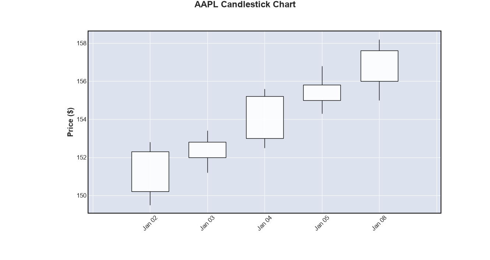
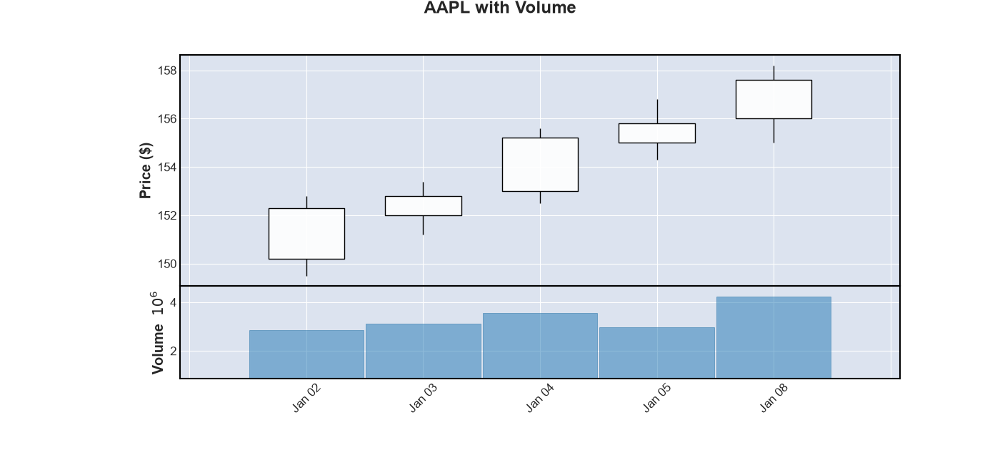
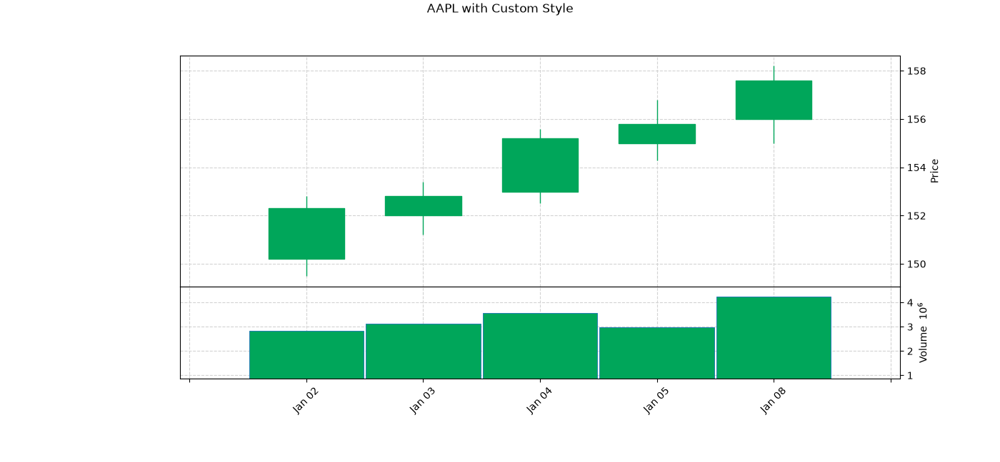

### 3.2 金融K线图绘制

在上一节中，我们掌握了Matplotlib的基础操作——折线图、子图布局、样式控制等。现在，我们将这些技能应用到金融数据的专属场景中，学习如何绘制金融市场中最重要、最经典的一种图表：K线图。

K线图（又称蜡烛图）是技术分析的基本语言。每一根K线用四个价格——开盘价、最高价、最低价、收盘价——浓缩了一个交易时段内的全部价格博弈信息。它不仅仅是一种数据可视化方式，更是一种承载着数百年市场智慧的符号系统。如果说技术分析是一种语言，那么K线就是这种语言的基本字母。mplfinance正是专门为绘制这类金融图表而设计的Python库，它基于Matplotlib构建，却提供了一套更加直观、更高层次的API。

#### mplfinance的设计理念

在mplfinance出现之前，绘制K线图通常需要直接操作Matplotlib的`candlestick2_ohlc`或`candlestick_ohlc`函数，代码冗长且不够友好。mplfinance的出现改变了这一局面。它借鉴了金融图表绘制的领域知识，将许多常见操作——如成交量展示、移动平均线叠加、多面板布局等——封装为简洁的参数，让绘图代码更加贴近分析思维。

mplfinance的核心理念可以用一句话概括：**将复杂的金融图表绘制简化为对`mpf.plot()`函数参数的配置**。它不试图取代Matplotlib的灵活性，而是在Matplotlib之上构建了一层专门为金融数据服务的抽象。

#### 数据准备：mplfinance的数据格式要求

mplfinance对输入数据有明确的要求。它需要的数据格式与上一章中我们准备的DataFrame几乎完全一致，但列名必须严格匹配：

| 列名     | 含义   | 必须            |
| -------- | ------ | --------------- |
| `Open`   | 开盘价 | ✅               |
| `High`   | 最高价 | ✅               |
| `Low`    | 最低价 | ✅               |
| `Close`  | 收盘价 | ✅               |
| `Volume` | 成交量 | ❌（但强烈建议） |

需要注意的是：列名的大小写是敏感的——必须是大写开头的`Open`、`High`、`Low`、`Close`和`Volume`，而不是我们之前在数据规范中使用的小写列名。此外，DataFrame的索引必须是`DatetimeIndex`类型，且按时间升序排列。

我们可以通过简单的列重命名来满足这一要求：

```python
import pandas as pd
import mplfinance as mpf

# Load data from previous chapter
def prepare_data_for_mpl(df):
    """
    Prepare DataFrame for mplfinance.
    Rename columns to match mplfinance requirements.
    """
    # Create a copy to avoid modifying the original
    plot_df = df[['open', 'high', 'low', 'close', 'volume']].copy()
    
    # Rename columns to mplfinance format
    plot_df.columns = ['Open', 'High', 'Low', 'Close', 'Volume']
    
    # Ensure the index is a DatetimeIndex
    # (if not already, convert it)
    if not isinstance(plot_df.index, pd.DatetimeIndex):
        plot_df.index = pd.to_datetime(plot_df.index)
    
    return plot_df

# Example usage
# df = prepare_stock_data('data/AAPL.csv')
# mpl_df = prepare_data_for_mpl(df)
```

#### 基础K线图绘制

数据准备就绪后，绘制第一张K线图只需要一行代码：

```python
import mplfinance as mpf

# Plot a basic candlestick chart
mpf.plot(
    mpl_df,
    type='candle',          # Candlestick chart type
    title='AAPL Candlestick Chart',
    ylabel='Price ($)',
    figsize=(14, 8)
)
```

`mpf.plot()`函数的第一个参数是包含OHLCV数据的DataFrame。`type='candle'`指定了图表类型——除了K线图外，还支持`'ohlc'`（OHLC柱状图）、`'line'`（折线图）、`'renko'`（砖形图）和`'pnf'`（点数图）。

`figsize`参数控制图表的尺寸，单位是英寸——(宽度, 高度)。对于金融图表，宽度略大于高度是常见的选择，这样能够更好地展示时间序列的走势。



#### 添加成交量子图

成交量是技术分析不可或缺的维度。mplfinance通过`volume=True`参数，可以在主图下方自动添加一个成交量子图：

```python
mpf.plot(
    mpl_df,
    type='candle',
    title='AAPL with Volume',
    ylabel='Price ($)',
    volume=True,            # Add volume subplot below the main chart
    volume_alpha=0.5,       # Transparency of volume bars
    figsize=(14, 10)
)
```

`volume=True`会在主图下方自动创建一个成交量面板。成交量柱的颜色默认与对应K线的涨跌颜色保持一致——上涨日期的成交量柱为绿色（或你定义的上涨颜色），下跌日期的成交量柱为红色。这种设计让量价关系一目了然。

通过`volume_alpha`参数可以控制成交量柱的透明度，0到1之间的数值，数值越低越透明。这对于密集的数据尤其有用，可以减少视觉上的杂乱感。



#### 样式控制：专业图表的外观

mplfinance最令人称道的一点是它对图表外观的精细控制。你可以通过`style`参数直接套用预设的主题样式：

```python
# List all available styles
print(mpf.available_styles())

# Apply different styles
styles = ['classic', 'binance', 'charles', 'nightclouds']

for style_name in styles:
    mpf.plot(
        mpl_df,
        type='candle',
        style=style_name,
        title=f'Style: {style_name}',
        volume=True,
        figsize=(12, 8)
    )
```

`available_styles()`会列出所有可用的预设样式名称。这些样式在颜色搭配、背景色、网格风格、坐标轴位置等方面各有侧重：

| 样式名称      | 特点描述                 | 适合场景               |
| ------------- | ------------------------ | ---------------------- |
| `classic`     | 白底黑字，经典传统风格   | 印刷出版、学术报告     |
| `charles`     | 白底，绿涨红跌，干净清晰 | 日常分析、屏幕展示     |
| `binance`     | 币安交易所风格           | 加密货币分析           |
| `nightclouds` | 深色背景，适合低光环境   | 夜盘交易、投影展示     |
| `yahoo`       | Yahoo Finance风格        | 与常见金融网站保持一致 |

如果你需要更精细的控制，可以创建自定义样式：

```python
# Create a custom market color scheme
market_colors = mpf.make_marketcolors(
    up='#00a65a',           # Green for up candles
    down='#dd4b39',         # Red for down candles
    edge='inherit',         # Same as candle body color for edges
    wick='inherit',         # Same as candle body color for wicks
    volume='inherit',       # Same as candle body color for volume bars
    alpha=1.0
)

# Create a custom style using the market colors
custom_style = mpf.make_mpf_style(
    marketcolors=market_colors,
    gridcolor='lightgray',
    gridstyle='--',
    y_on_right=True        # Place y-axis label on the right side
)

mpf.plot(
    mpl_df,
    type='candle',
    style=custom_style,
    title='AAPL with Custom Style',
    volume=True,
    figsize=(14, 8)
)
```

`make_marketcolors`用于定义市场相关的颜色——上涨、下跌、影线、边缘、成交量等元素的颜色；`make_mpf_style`则将这些颜色整合为一个完整的样式对象，同时还能控制网格颜色、线条样式、坐标轴位置等更广泛的视觉元素。



#### 添加移动平均线

移动平均线是最基础、最重要的技术指标之一。mplfinance通过`mav`参数，可以一键在K线图上叠加移动平均线：

```python
mpf.plot(
    mpl_df,
    type='candle',
    mav=(20, 50, 120),      # Moving average windows: 20-day, 50-day, 120-day
    title='AAPL with Moving Averages',
    ylabel='Price ($)',
    volume=True,
    figsize=(14, 10)
)
```

`mav=(20, 50, 120)`会在K线图上叠加三条移动平均线——20日、50日和120日简单移动平均线（SMA）。这三条线是许多趋势跟踪策略的核心参考线。在技术分析中，20日均线常被视为短期趋势的分界线，50日均线是中期趋势的核心指标，而120日均线（半年线）则反映了长期趋势。

默认情况下，`mav`参数绘制的是简单移动平均线（SMA）。如果你想使用指数移动平均线（EMA），或者对移动平均线有更精细的控制，可以传入一个字典：

```python
# Extended moving average configuration
mav_config = {
    'period': (20, 50, 120),    # Three moving average periods
    'type': 'ema',              # Exponential moving average
    'offset': (0, 0, 0)         # No offset shift
}

mpf.plot(
    mpl_df,
    type='candle',
    mav=mav_config,
    title='AAPL with EMA',
    volume=True,
    figsize=(14, 10)
)
```

#### 叠加自定义指标

对于mplfinance没有内置的指标（如布林带、RSI、MACD等），我们可以先使用TA-Lib计算这些指标，然后通过`make_addplot()`将它们添加到图表中。这是mplfinance最强大的功能之一——它将TA-Lib的计算能力与mplfinance的展示能力无缝连接起来。

```python
import talib

# Calculate technical indicators using TA-Lib
close_prices = mpl_df['Close'].values
high_prices = mpl_df['High'].values
low_prices = mpl_df['Low'].values
volumes = mpl_df['Volume'].values

# Calculate Bollinger Bands
upper, middle, lower = talib.BBANDS(
    close_prices,
    timeperiod=20,
    nbdevup=2,
    nbdevdn=2,
    matype=talib.MA_Type.SMA
)

# Calculate RSI
rsi = talib.RSI(close_prices, timeperiod=14)

# Add Bollinger Bands as custom plots on the main panel (panel=0)
add_plots = [
    mpf.make_addplot(upper, color='gray', linestyle='--', width=1, panel=0),
    mpf.make_addplot(middle, color='blue', linestyle='-', width=1, panel=0),
    mpf.make_addplot(lower, color='gray', linestyle='--', width=1, panel=0),
    # Add RSI on a separate panel (panel=2)
    mpf.make_addplot(rsi, color='purple', panel=2, ylabel='RSI')
]

# Create the full chart
mpf.plot(
    mpl_df,
    type='candle',
    volume=True,            # volume takes panel=1 by default
    addplot=add_plots,      # our custom plots: panel=0 and panel=2
    panel_ratios=(3, 1, 1), # Height ratios: main panel is 3 times taller
    title='AAPL with Bollinger Bands and RSI',
    figsize=(14, 12)
)
```

`make_addplot()`函数用于创建一个"附加图层的配置"。它的关键参数包括：

- **panel**：指定这个附加图层应该显示在哪个面板上。`panel=0`表示主图面板（K线图所在的面板），`panel=1`通常被成交量占用，`panel=2`、`panel=3`等则是新增的面板。
- **color**：线条颜色。
- **linestyle**：线条样式——`'-'`实线、`'--'`虚线、`':'`点线等。
- **width**：线条宽度。
- **ylabel**：面板的Y轴标签（当面板新增时尤其有用）。

`panel_ratios`参数控制各个面板的高度比例。在上面的例子中，`(3, 1, 1)`表示主面板、成交量面板、RSI面板的高度比为3:1:1。这样的比例安排让主图占据主要视觉空间，而辅助指标面板则紧凑地排列在下方。

`make_addplot`支持多种数据类型——Pandas Series、DataFrame、NumPy数组、Python列表均可。你可以用它叠加均线、绘制交易信号点、甚至绘制柱状图：

```python
# Adding buy/sell signals as scatter plots
# Create signal series with NaN where no signal occurs
buy_signals = pd.Series(index=mpl_df.index, dtype=float)
sell_signals = pd.Series(index=mpl_df.index, dtype=float)

# Assume some logic to determine buy/sell points
# For demonstration, we mark points where price crosses above/below Bollinger Bands
buy_signals[(close_prices < lower) & (close_prices.shift(1) >= lower.shift(1))] = close_prices
sell_signals[(close_prices > upper) & (close_prices.shift(1) <= upper.shift(1))] = close_prices

signal_plots = [
    mpf.make_addplot(buy_signals, type='scatter', marker='^', markersize=100, color='green'),
    mpf.make_addplot(sell_signals, type='scatter', marker='v', markersize=100, color='red')
]

mpf.plot(
    mpl_df,
    type='candle',
    addplot=signal_plots,
    title='AAPL with Buy/Sell Signals',
    volume=True,
    figsize=(14, 10)
)
```

`type='scatter'`将绘制散点图而不是折线图。`marker='^'`表示向上三角形（买入信号），`marker='v'`表示向下三角形（卖出信号），`markersize`控制点的大小。通过这种方式，你可以直观地在K线图上标注出策略的入场和出场点位。

#### 保存图表到文件

与Matplotlib类似，mplfinance支持将绘制的图表保存为图片文件：

```python
mpf.plot(
    mpl_df,
    type='candle',
    style='charles',
    title='AAPL Daily Chart',
    volume=True,
    savefig='charts/aapl_daily.png',      # Save to file
    figsize=(14, 8)
)

# For higher quality output with more control
mpf.plot(
    mpl_df,
    type='candle',
    style='charles',
    title='AAPL Daily Chart',
    volume=True,
    savefig={
        'fname': 'charts/aapl_daily_hq.png',
        'dpi': 300,
        'facecolor': 'white',
        'bbox_inches': 'tight'
    },
    figsize=(14, 8)
)
```

`savefig`参数可以是一个字符串（文件路径），也可以是一个字典，用于更精细地控制保存参数。`dpi=300`可以提高输出分辨率，适合打印或在报告中展示。

通过这一节的学习，我们已经掌握了使用mplfinance绘制专业金融K线图的核心技能——从数据准备、基础绘图到样式控制、移动平均线叠加、自定义指标添加以及图表保存。在后续章节的实战案例中，我们将频繁使用这些技能来可视化各类技术指标的计算结果。
